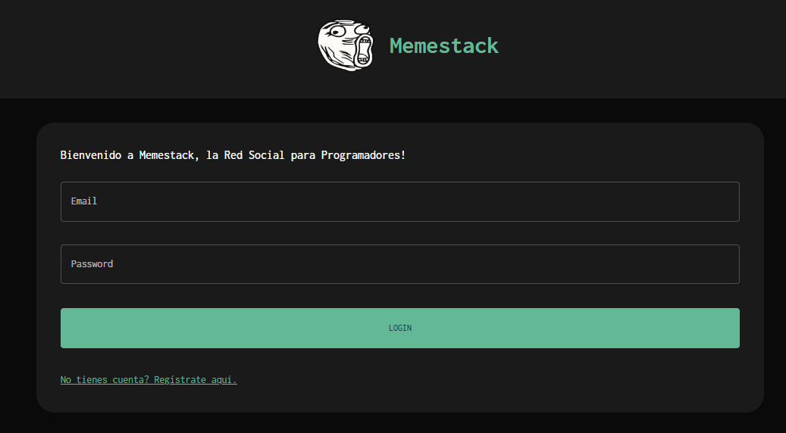
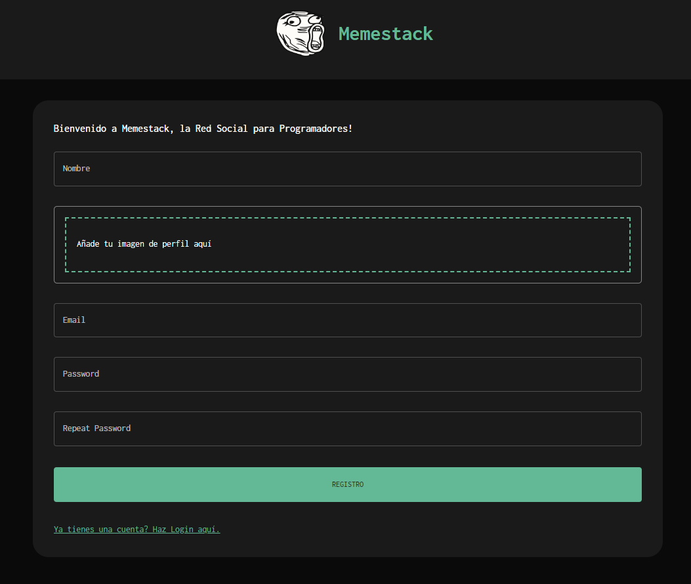
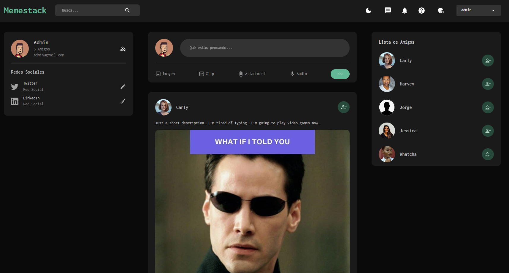
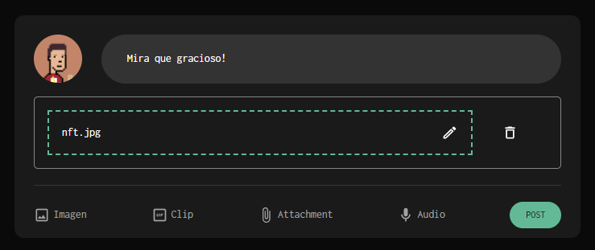
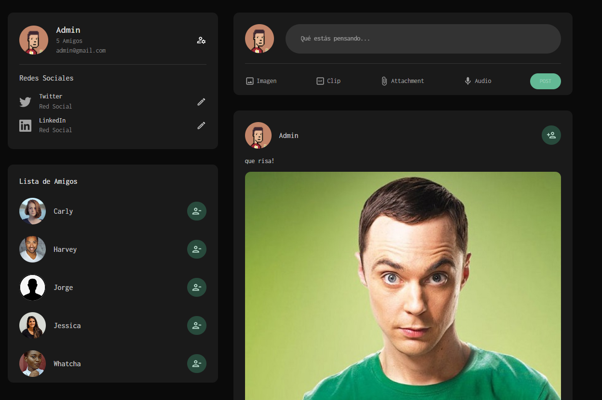
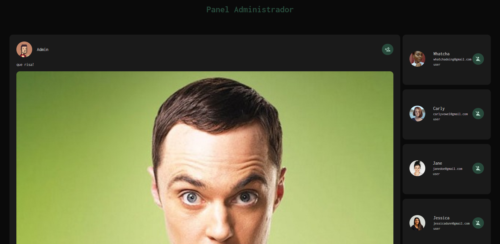

<!-- LOGO -->

<p align="center">
  
</p>

<!-- INDICE -->
<details>
  <summary>Indice</summary>
  <ol>
    <li>
      <a href="#introducción">Introducción</a>
      <ul>
        <li><a href="#descripción">Tecnologías</a></li>
      </ul>
    </li>
    <li>
      <a href="#descripción-del-proyecto">Descripción del proyecto</a>
      <ul>
        <li><a href="#instalación">Instalación</a></li>
      </ul>
    </li>    
    <li><a href="#licencia">Licencia</a></li>
    <li><a href="#contacto">Contacto</a></li>
    <li><a href="#conocimientos">Conocimientos</a></li>
  </ol>
</details>

<!-- SOBRE EL PROYECTO -->

## Introducción

Este proyecto trata de realizar el Front de una red social en la que los usuarios se registrarán, logearán y publicarán utilizando la API de la red social.


### Tecnologías

Aquí presentamos las herramientas empleadas en este proyecto:

- [React](https://es.reactjs.org/)
- [Redux](https://es.redux.js.org/)
- [Router](https://reactrouter.com/)
- [JavaScript](https://developer.mozilla.org/es/docs/Web/JavaScript)
- [Material UI](https://mui.com)
- [Yup](https://www.npmjs.com/package/yup)
- [Formik](https://formik.org/)
- [React-dotenv](https://www.npmjs.com/package/react-dotenv)
- [Cypress](https://www.cypress.io/)

<!-- DESCRIPCION -->

## Descripción

Esta red social es una red hecha por y para programadores. En ella podrás compartir tus mejores memes del mundo de la programación. 

Proyecto programado con Stack MERN.

## FrontEnd Red Social

Las funcionalidades del proyecto son las siguientes:
- Registro de usuarios.
- Login de usuarios.
- Publicar post.
- Borrar o editar tus propios posts desde tu perfil.
- Comentar posts.
- Dar like a posts y/o comentarios.
- Vista de admin donde borrar cualquier post.
- Buscador de posts
- Implementación de guards
- El usuario puede subir fotos en los posts o cambiar su foto de perfil.
- El usuario en su perfil puede ver el número de seguidores y número de a cuantos sigue


## GUÍA DE USO

<br><br>

Pantalla de login





<br><br>

Si no estás registrado puedes hacerlo en la pantalla de registro



<br><br>

Una vez registrado y loggeado accedes a la vista principal de los posts publicados donde puedes darle like al que más te guste así como entrar en detalle del post y comentarlo




<br><br>
 
 Con el botón de share your meme podrás compartir tu meme más gracioso



<br><br>

Si haces click sobre la foto de tu avatar podrás acceder a tu perfil o desconectarte de la sesión. En tu perfil podrás editar o borrar tu posts




<br><br>

Si tienes privilegios de administrador tienes una vista donde poder borrar cualquier post que no cumpla las condiciones de la página.




### Instalación

1. Para la instalación de la aplicación has de clonarte el siguiente repositorio:

   ```sh
    https://github.com/Yorch82/SocialFrontend.git
   ```

2. Una vez clonado has de instalar las dependencias del proyecto:
   ```sh
   npm install
   ```
4. Crear archivo .env y añadir la siguiente variable:

    ```sh
    REACT_APP_API_URL = https://memestack-backend.adaptable.app
    ```
3. Iniciar proyecto:
    ```sh
    npm start
   ```
<!-- ROADMAP -->

## Experiencia

- [x] Redux
- [x] Componentes
- [x] Estados y ciclo de vida de componentes


<!-- LICENCIA -->

## Licencia

Este programa es de código abierto y puede ser utilizado por cualquier persona que lo desee.

<!-- CONTACTO -->

## Contacto

Jorge - [gitHub](https://github.com/yorch82)

<!-- CONCOCIMIENTOS -->

## Conocimientos

- [x] React
- [x] Redux

